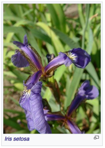
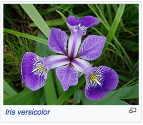
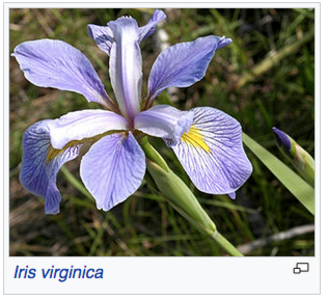

# iris demo

Simple Machine Learning application to showcase how to deploy ML applications.

This application uses the famous [iris dataset][iris] to create a decision tree model and deploys it as an API.

[iris]: https://en.wikipedia.org/wiki/Iris_flower_data_set

*Pictures are from the [wikipedia page][iris], CC BY-SA.*

See the [notebook](iris.ipynb) to get started.

## Deploy with rorodata button

